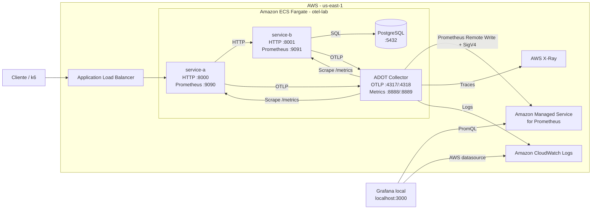

# Laboratorio de Observabilidad con OpenTelemetry en AWS

Este repositorio implementa un laboratorio de observabilidad distribuida sobre **AWS ECS Fargate**, utilizando **OpenTelemetry**, **AWS Distro for OpenTelemetry (ADOT)**, **Amazon Managed Service for Prometheus (AMP)**, **AWS X-Ray**, **Amazon CloudWatch** y **Grafana local**.

El objetivo es instrumentar dos servicios HTTP, correlacionar métricas, trazas y logs, visualizar indicadores operativos y comparar el impacto de rendimiento de la instrumentación OpenTelemetry.

---

## 1. Objetivos

- Instrumentar `service-a` y `service-b` con OpenTelemetry.
- Generar trazas distribuidas entre servicios.
- Exportar métricas mediante Prometheus.
- Exportar trazas hacia AWS X-Ray.
- Exportar logs hacia Amazon CloudWatch Logs.
- Enviar métricas desde ADOT hacia Amazon Managed Service for Prometheus.
- Consultar AMP y CloudWatch desde Grafana local.
- Construir un dashboard con SLIs de aplicación e infraestructura.
- Ejecutar pruebas de carga y comparar baseline vs. OpenTelemetry.

---

## 2. Arquitectura



Se incluye también el archivo editable de arquitectura:

`arquitectura-otel-aws.drawio`

---

## 3. Componentes

| Componente | Función |
|---|---|
| `service-a` | Servicio de entrada expuesto por el ALB. Invoca `service-b`. |
| `service-b` | Servicio backend. Realiza operaciones sobre PostgreSQL. |
| PostgreSQL | Base de datos utilizada por `service-b`. |
| ADOT Collector | Recibe OTLP, hace scrape Prometheus y exporta telemetría a AWS. |
| Amazon ECS Fargate | Plataforma de ejecución de los contenedores. |
| Application Load Balancer | Punto de entrada HTTP a `service-a`. |
| Amazon Managed Service for Prometheus | Backend central de métricas. |
| AWS X-Ray | Backend de trazas distribuidas. |
| Amazon CloudWatch Logs | Backend de logs. |
| Grafana local | Visualización de métricas e infraestructura. |
| k6 | Generación de carga y benchmark. |

---

## 4. Flujo de observabilidad

### Métricas

```text
service-a :9090 ─┐
                 ├──> ADOT Collector
service-b :9091 ─┘
                       |
                       | Prometheus Remote Write + SigV4
                       v
                      AMP
                       |
                       v
                 Grafana local
```

### Trazas

```text
service-a -> service-b -> PostgreSQL
     |
     v
ADOT Collector
     |
     v
AWS X-Ray
```

### Logs

```text
service-a / service-b
        |
        v
ADOT Collector
        |
        v
Amazon CloudWatch Logs
```

Los logs incluyen `trace_id` y `span_id` para facilitar la correlación entre logs y trazas.

---

## 5. Instrumentación OpenTelemetry

La instrumentación implementada contempla:

- OpenTelemetry SDK.
- Instrumentación de FastAPI.
- Instrumentación HTTP con HTTPX.
- Instrumentación PostgreSQL con Psycopg2.
- Spans manuales para operaciones relevantes.
- Exportación OTLP hacia ADOT.
- Métricas Prometheus.
- Logs JSON estructurados.
- Feature flag:

```text
OTEL_ENABLED=true|false
```

Esto permite ejecutar el mismo servicio con y sin OpenTelemetry para comparar overhead.

---

## 6. Puertos

| Componente | Puerto | Uso |
|---|---:|---|
| `service-a` | 8000 | API HTTP |
| `service-a` | 9090 | Métricas Prometheus |
| `service-b` | 8001 | API HTTP |
| `service-b` | 9091 | Métricas Prometheus |
| PostgreSQL | 5432 | Base de datos |
| ADOT | 4317 | OTLP gRPC |
| ADOT | 4318 | OTLP HTTP |
| ADOT | 8888 | Métricas internas |
| ADOT | 8889 | Exporter Prometheus |
| ADOT | 13133 | Health check |
| Grafana | 3000 | Interfaz web |

---

## 7. ADOT Collector

Configuración AWS:

```text
otel-collector/collector-config-aws.yaml
```

Dockerfile:

```text
otel-collector/Dockerfile.aws
```

La configuración incluye:

- `otlp` receiver.
- `prometheus` receiver.
- `memory_limiter`.
- `resource`.
- `resourcedetection`.
- `batch`.
- filtro de health checks.
- `awsxray` exporter.
- `prometheusremotewrite` hacia AMP.
- `awscloudwatchlogs` exporter.
- `sigv4auth` para AMP.

Formato del endpoint de Remote Write:

```text
https://aps-workspaces.<region>.amazonaws.com/workspaces/<workspace-id>/api/v1/remote_write
```

---

## 8. IAM del Task Role

El Task Role de ECS requiere:

```text
AmazonPrometheusRemoteWriteAccess
AWSXRayDaemonWriteAccess
CloudWatchAgentServerPolicy
```

El **Task Role** es utilizado por ADOT en tiempo de ejecución. No debe confundirse con `executionRoleArn`.

---

## 9. Deployment en ECS

Task Definition:

```text
k8s/aws/ecs-task-definition-lab.json
```

Configuración del Collector:

```json
"command": [
  "--config=/etc/otel-config.yaml"
]
```

Dentro de una misma task Fargate se utiliza localhost:

```text
service-a -> http://127.0.0.1:8001
service-b -> 127.0.0.1:5432
services  -> http://127.0.0.1:4317
```

---

## 10. Dashboard Grafana

El laboratorio utiliza seis paneles:

| # | Panel | Datasource | Visualización |
|---|---|---|---|
| 1 | Disponibilidad | AMP | Stat |
| 2 | Latencia p95 | AMP | Time series |
| 3 | Tasa de errores HTTP 5xx | AMP | Stat |
| 4 | Throughput / RPS | AMP | Time series |
| 5 | CPU ECS | CloudWatch | Time series |
| 6 | Errores OTel Collector | AMP | Time series |

### Disponibilidad

```promql
100 *
sum(rate(http_requests_total{job="service-a",route!="/health",status=~"2.."}[5m]))
/
clamp_min(
  sum(rate(http_requests_total{job="service-a",route!="/health"}[5m])),
  0.000001
)
```

### Latencia p95

```promql
histogram_quantile(
  0.95,
  sum by (le) (
    rate(http_request_duration_seconds_bucket{job="service-a",route!="/health"}[5m])
  )
)
```

### Error rate 5xx

```promql
100 *
sum(rate(http_requests_total{job="service-a",route!="/health",status=~"5.."}[5m]))
/
clamp_min(
  sum(rate(http_requests_total{job="service-a",route!="/health"}[5m])),
  0.000001
)
```

### Throughput / RPS

```promql
sum(
  rate(http_requests_total{job="service-a",route!="/health"}[5m])
)
```

### CPU ECS

```text
Datasource: CloudWatch
Namespace: AWS/ECS
Metric: CPUUtilization
ClusterName: otel-lab
ServiceName: otel-lab-svc
Statistic: Average
```

### Errores del Collector

```promql
sum(
  rate(
    {__name__=~"otelcol_exporter_send_failed_(spans|metric_points|log_records)(_total)?"}[5m]
  )
)
```

> Si los nombres o labels reales de las métricas difieren, deben ajustarse con el Metrics Browser de Grafana.

---

## 11. Validación funcional

Health check:

```powershell
Invoke-RestMethod "http://<ALB-DNS>/health"
```

Resultado esperado:

```text
status       : ok
service      : service-a
otel_enabled : True
```

Generación de tráfico:

```powershell
1..100 | ForEach-Object {
    try {
        Invoke-RestMethod "http://<ALB-DNS>/order/ord-001" | Out-Null
        Write-Host "Request $_ OK"
    }
    catch {
        Write-Host "Request $_ ERROR"
    }
    Start-Sleep -Milliseconds 100
}
```

---

## 12. Validación AMP

En Grafana Explore con `AMP-AWS`:

```promql
up
```

Todas las métricas:

```promql
{__name__=~".+"}
```

Descubrimiento de métricas HTTP:

```promql
count by (__name__) ({__name__=~".*http.*"})
```

---

## 13. Trazas distribuidas

Las trazas se exportan hacia AWS X-Ray.

Flujo esperado:

```text
service-a
   |
   v
service-b
   |
   v
PostgreSQL
```

---

## 14. Logs y correlación

Los logs se exportan a CloudWatch Logs e incluyen:

```text
trace_id
span_id
service.name
severity
error.type
```

Esto permite correlacionar un evento de log con su traza distribuida.

---

## 15. Benchmark de overhead

Escenarios:

### Baseline

```text
OTEL_ENABLED=false
```

### Instrumentado

```text
OTEL_ENABLED=true
```

Indicadores:

- p99 de latencia.
- CPU promedio.
- memoria utilizada.
- throughput.
- tasa de errores.

Fórmulas:

```text
p99 overhead % =
((p99_otel - p99_baseline) / p99_baseline) * 100
```

```text
CPU overhead % =
((cpu_otel - cpu_baseline) / cpu_baseline) * 100
```

```text
Memory overhead % =
((mem_otel - mem_baseline) / mem_baseline) * 100
```

---

## 16. Estructura del repositorio

```text
.
├── service-a/
├── service-b/
├── otel-collector/
│   ├── collector-config-aws.yaml
│   └── Dockerfile.aws
├── benchmark/
├── grafana/
├── k8s/
│   └── aws/
│       └── ecs-task-definition-lab.json
├── docker-compose.grafana-aws.yaml
├── arquitectura-otel-aws.drawio
└── README.md
```

---

## 17. Seguridad

No subir a GitHub:

- AWS Access Keys.
- AWS Secret Access Keys.
- tokens.
- contraseñas.
- archivos `.env` con secretos.
- archivos locales de credenciales.

Ejemplo de `.gitignore`:

```gitignore
.env
*.env
.aws/
credentials
.grafana-aws.env
.grafana-aws/
__pycache__/
*.pyc
results_baseline.csv
results_otel.csv
```

---

## 18. Resultado

```text
Aplicación
   |
   +--> Métricas --> AMP --> Grafana
   |
   +--> Trazas ----> X-Ray
   |
   +--> Logs ------> CloudWatch
```

La solución proporciona observabilidad de aplicación e infraestructura, correlación entre señales y capacidad de medir el impacto de rendimiento de OpenTelemetry.
